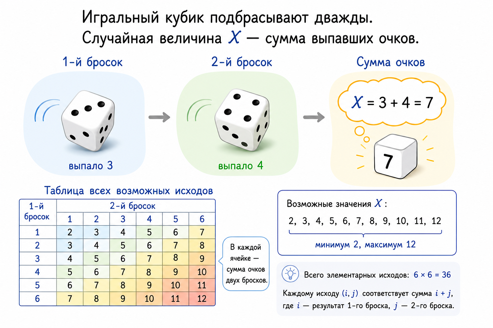

## Случайная величина

> **_Случайная величина_** --- это любая функция, аргументами которой служат элементарные исходы, а значениями являются какие-то действительные числа, т.е. 
> $X: \Omega \rightarrow \mathbb{R}$.

> [!NOTE]
> **Пример**
> 
> Игральный кубик подбрасывают дважды. 
> - Элементарное событие --- пара $(a, b)$, где $a,b$ --- очки, выпавшие при первом и втором подбрасывании, соответственно. $a, b \in \{1, 2, \ldots, 6\}$;
> - Пространство $\Omega$ --- всевозможные такие пары (всего $36$ пар);
> - Случайная величина $X$ --- "сумма выпавших очков";
> - $X$ принимает натуральные значения от $2$ до $12$.
>
> Отметим, что на одном и том же пространстве можно задать несколько случайных величин. Например, можно задать величину $Y$, равную произведению выпавших очков.

<figure class="figure figure--small" id="fig-dice">

<figcaption>
Случайная величина как сумма результатов двух бросков.
</figcaption>

</figure>

>Случайная величина называется ***дискретной***, если множество её значений дискретно, т.е. если любые два числа из этого множества можно отделить друг от друга интервалом, в котором нет элементов этого множества.

Значения дискретной случайной величины можно пронумеровать натуральными числами в порядке возрастания.

## Распределение случайной величины

Для произвольной случайной величины $X$ можно рассмотреть событие $X = a$, где $a$ --- некоторое значение, которое принимает случайная величина. 
Это событие включает все такие исходы, что $X$ принимает на них значение $a$, т.е. его можно записать в виде ${A = \{\omega \in \Omega: X(ω)=a\}}$. 

Например, событию $X = 2$ с  [картинки](#fig-dice), благоприятствует только одно событие, а значение $X = 4$ случайная величина принимает в трёх случаях.

Вероятность события $X = a$ можно найти как сумму вероятностей всех таких исходов, то есть

$$ P(X = a) = \sum\limits_{\omega: X(\omega) = a} P(\omega).$$

Пусть задана случайная величина $X:\Omega \to \{a_1, \ldots, a_k\}$, где $k \in \mathbb{N}, k\leqslant n$. Тогда  cобытия $X = a_i$ --- попарно не пересекаются и  в совокупности покрывают всё пространство $\Omega$, т.е.
  $$ P(X = a_1)+P(X = a_2)+ \ldots + P(X = a_k) = 1. $$

>Набор вероятностей $P(X = a_i)$ называется **_распределением вероятностей_**  случайной величины $X$.

>Соответствие между значениями случайной величины и их вероятностями называется ***распределением вероятностей*** случайной величины.

Запись $X \sim \begin{pmatrix} x_1 & x_2  & \dots & x_k  \\ p_1 & p_2  & \dots & p_k \end{pmatrix}$ означает, что случайная величина имеет заданное распределение.

Случайная величина "сумма выпавших очков" c [рисунка выше](#fig-dice) подчиняется распределению 
  $$X \sim \begin{pmatrix} 
  2 & 3 & 4 & 5 & 6 & 7 & 8 & 9 & 10 & 11 & 12 \\ 
  \cfrac{1}{36} & \cfrac{1}{18} & \cfrac{1}{12} & \cfrac{1}{9} & \cfrac{5}{36} & \cfrac{1}{6} & \cfrac{5}{36} & \cfrac{1}{9} & \cfrac{1}{12} & \cfrac{1}{18} & \cfrac{1}{36} 
  \end{pmatrix}.$$
