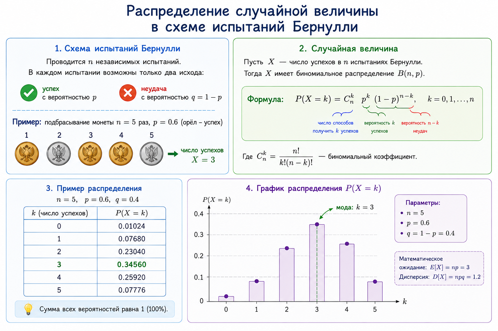

## Биномиальное распределение

Рассмотрим схему испытаний Бернулли c вероятностью успеха $p$ и $n$ испытаниями. Пусть случайная величину $X(\omega)$ --- это количество успехов в элементарном исходе $\omega$, то есть её можно задать формулой
$$X(\omega) = \sum\limits_{i = 1}^n w_i,\;\; \text{где} \;\; \omega = (w_1, \ldots, w_n), \; w_i \in \{0, 1\}. $$
- $X(\omega)$ принимает значения от $0$ до $n$;
- Вероятность того, что $X(\omega)$ примет значение $k$, равна
  $$ P(X = k) = C_n^k \cdot p^k \cdot (1-p)^{n - k}.$$
- Говорят, что величина $X$ имеет **_биномиальное распределение_** и  обозначают $Binom(n,p)$.

Cлучайная величина $X:\Omega \rightarrow \{0, 1, \ldots, n\}$ на произвольном пространстве элементарных исходов имеет **биномиальное распределение**, если она принимает значения от $0$ до $n$ с вероятностями
$$ P(X = k) = C_n^k p^k (1-p)^{n - k}$$
 для некоторого $p\in (0,1)$. .

Распределение $$\begin{pmatrix} 
   0 & 1 & 2 & \ldots & k &  \ldots & n\\ 
   q^n & C_n^1\cdot p\cdot q^{n-1} & C_n^2\cdot p^2\cdot q^{n-2} & \ldots & C_n^k\cdot p^k\cdot q^{n-k} & \ldots & p^n
   \end{pmatrix}, $$
где  $p\in (0;1), \; q = 1-p$, 
 
называется **биномиальным** распределением с параметрами $n$ и $p$.

<figure class="figure figure--small" id="fig-dice">

<figcaption>
Случайная величина как сумма результатов двух бросков (нарисовано ИИ).
</figcaption>

</figure>

- Количество рёбер в случайном графе имеет биномиальное распределение $Binom(C_n^2,p)$.

## Геометрическое распределение

Рассмотрим испытания, которые проводятся до тех пор, пока не случится успех. Например, кубик подбрасывают, пока не выпадет число $1$. Если вероятность успеха в одном испытании равна  $p$, то вероятность, что потребуется ровно $k$ испытаний равна $P(X = k) = q^{k-1}p$, где $q = p-1$ --- вероятность неудачи, $k = 1, 2, 3, \ldots$.

Распределение $$\begin{pmatrix} 
   1 & 2 & 3 & 4 & 5 & \ldots \\ 
   p & q\cdot p & q^2\cdot p & q^3\cdot p & q^4\cdot p & \ldots 
   \end{pmatrix}, \;\; p\in (0;1), \; q = 1-p$$
называется **геометрическим** распределением с параметром $p$.

Обозначения: $X\sim G(p)$ или $X\sim Geom(p)$.

Пример

Игральный кубик бросают, пока не выпадет единица.
- Случайная величина $Y$ --- число сделанных бросков;
- Вероятность успеха при одном броске равна $p = \cfrac{1}{6}$;
- $Y \sim \begin{pmatrix} 1 & 2 & 3 & \dots & k & \dots \\ \cfrac{1}{6} & \cfrac{5}{36} & \cfrac{25}{216} & \dots & \cfrac{1}{6} \cdot \left(\cfrac{5}{6}\right)^{k-1} & \dots \end{pmatrix}$. 
- Вероятность, что потребовалось ровно три броска равна $P(Y = 3) = \cfrac{25}{216}$;
- Событие "потребовалось  больше трёх бросков для достижения успеха" произойдёт, если первые три броска завершатся неудачей, т.е.  $$P(Y > 3) = \left(\cfrac{5}{6}\right)^3 = \cfrac{125}{216};$$
- Найдем вероятность того, что потребовалось меньше $4$-x бросков двумя способами:
  -  $P(Y<4) = P(Y = 1) + P(Y = 2) + P(Y = 3) = \cfrac{1}{6} + \cfrac{5}{36} + \cfrac{25}{216} = \cfrac{91}{216}$;
  
  - $P(Y<4) =P(Y \leqslant 3) = 1 - P(Y>3) = 1 - \left(\cfrac{5}{6}\right)^3 = \cfrac{91}{216}$.

## Усечённое геометрическое распределение.

Рассмотрим схему испытаний Бернулли с параметрами $n$ и $p$. Определим случайную величину $X$ следующим образом: 
- $X(\omega)$  равно номеру первого успеха в элементарном исходе $\omega$; 
- Если $\omega$ --- это элементарный исход, состоящий из всех неудач, то $X(\omega)$ равно $n$. 

Найдём распределение величины $X$.

- Пусть первый успех случился при $k < n$. Тогда  $P(X=k) = (1-p)^{k-1}\cdot p$:
- $X = n$, если первые $n-1$ испытания были неудачными (как завершилось последнее испытаниие уже неважно), т.е. $P(X=k) = (1-p)^{n-1}$.
- Проверим, что $\sum\limits_{k = 1}^n P(X = k) = 1$:

$$\sum\limits_{k = 1}^n P(X = k) = p + p\cdot (1-p) + p\cdot (1-p)^2+ \ldots + p\cdot (1-p)^{n-1} + (1-p)^{n - 1} =$$
  $$= \cfrac{p\cdot ((1-p)^{n-1} - 1)}{(1-p) - 1} + (1-p)^{n-1} = 1.$$

